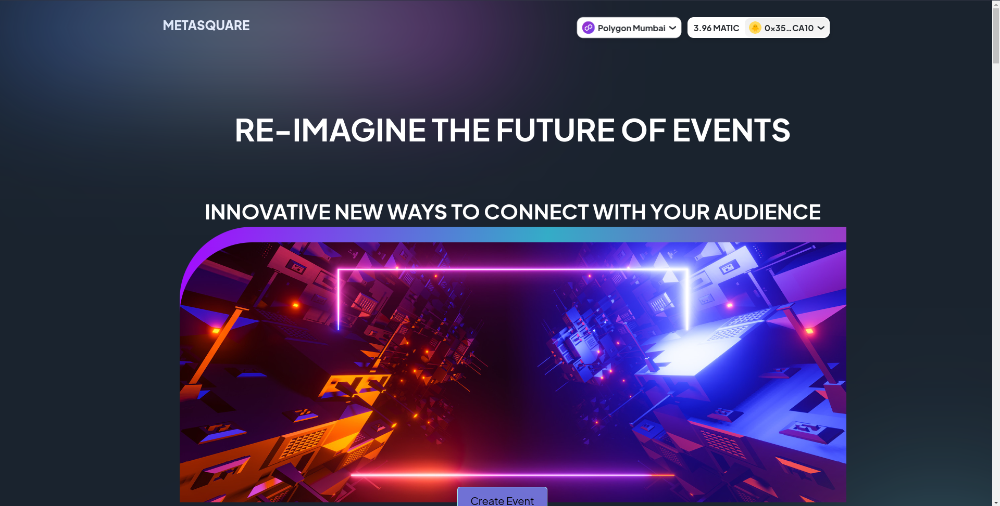

# Meta Square NFT Smart Ticketing Dapp

[Visit DAPP](https://meta-square.vercel.app/)

_Meta Square is an NFT-based smart ticketing platform designed for event hosts and attendees. The platform provides a secure and transparent way for event hosts to manage their events and ticket sales, while also giving attendees a unique and valuable experience._

## How It Works:

**Generate ID:** Event hosts contacts the MetaSquare Team and we generate a unique ID on the Meta Square platform which they use to create events.

**Attendee Registration:** Attendees can then register for these events using their wallets, and for each registration, an NFT representing the ticket will be minted to their wallet. This ensures that no user can register twice and prevents ticket fraud.

**POAP Distribution:** After the event, attendees will be able to mint a special POAP NFT provided by Meta Square. These POAPs can be sold in secondary markets, providing additional value to attendees.

---

## Features

**Meta Square offers the following features to event hosts and attendees:**

- Secure and transparent ticket sales using NFTs
- Prevention of ticket fraud and double registrations
- Easy event creation and management for event hosts
- Unique and valuable event experiences for attendees
- Ability for attendees to mint special POAP NFTs after the event for additional value

---

## Future Plans

**We plan to expand the Meta Square platform in the future to include more features and services, including:**

- Integration with other NFT-based platforms
- Customizable NFT designs for event tickets
- Additional event management tools for event hosts
- More valuable and unique POAP NFTs for attendees

---

## Vision

Meta Square is an innovative and secure NFT-based smart ticketing platform that offers a unique and valuable experience for both event hosts and attendees. With our platform, event hosts can easily manage their events and ticket sales, while attendees can enjoy a secure and transparent ticketing process and the opportunity to mint valuable POAP NFTs after the event. We look forward to continuing to develop and improve our platform to provide even more value to our users.

---

## forge script script/deployer.s.sol:TicketScript --rpc-url $SEPOLIA_RPC --broadcast --verify

## to deploy on sepolia testnet

---

#### FACTORY: 0x4401ee208489e55ad9abedabcc0c45c59a30914d

#### iTicketChild: 0x30da434314b656d26a8dc2f76345509058c952bc

#### POAP: 0xA646cF33aD00c77B7742eeCD347D5dEDe2C24974

#### MUMBAI TESTNET

#### POAP = 0x1dEB59a06412Cc2CEacAD6FE5b6Ce5A54E64b0C2

#### EVENT NFT = 0xCEE81d04132fE60dbC65D8eD1E169F5c6189A0E3

#### iTicketChild = 0xCEE81d04132fE60dbC65D8eD1E169F5c6189A0E3

#### FACTORY = 0xe97905dD2460E336D74A68f6bEAd809b8604ebC1

> > > > > > > > > > > > > > MUMBAI WITH CID FIXED <<<<<<<<<<<>>>>>>>>>>>

#### POAP = 0xc10819f90D13B52A95072c695aa7CAcbe9cD6Ebb

#### EVENTNFT = 0x6477bCA434a9e96910d6Fc047cF35feDf4C6e9a1

#### CHILD CONTRACT = 0x6477bCA434a9e96910d6Fc047cF35feDf4C6e9a1

#### FACTORY = 0x0B2FE3c1E6F004E5024Dc4B3850e2dE316944c25
